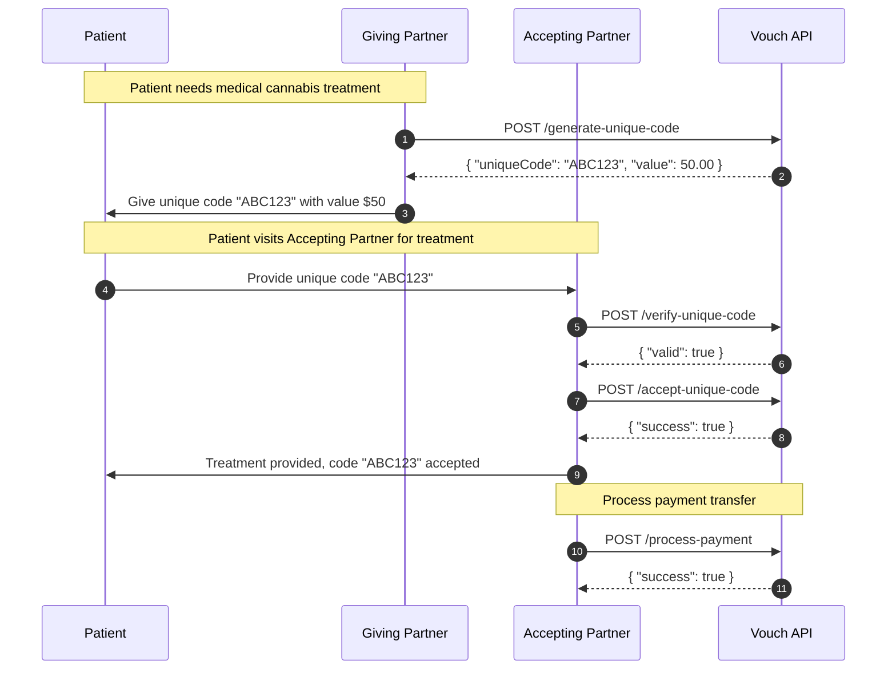
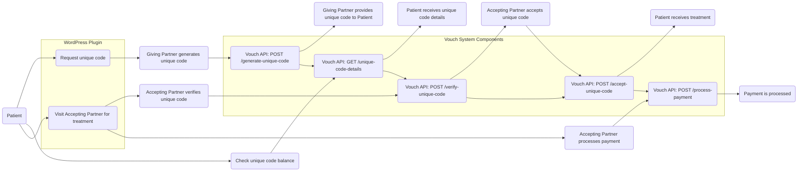

# Vouch

Our vouch system makes it easy for you to access medical cannabis treatments from registered clinics and trusted partners in New Zealand. With a simple and secure process, you can receive the care you need and support the growth of the medical cannabis industry.

[//]: # (badges)

### Support

    

### Test Coverage

    

[//]: # (badges)

### Diagram 





## Focus

- The program will provide a unique code to patients that can be redeemed with registered clinics and trusted partners for medical cannabis treatments.
- The unique code will have a fixed value that will be determined when the code is requested.
- The program will provide a web portal for patients to check the balance and details of their unique code.
- The program will provide a plugin for WordPress and other PHP or Node.js e-commerce sites to accept the unique code and make it easy for companies to participate.
- The program will ensure that patient data is secure and compliant with relevant regulations.
- The program will be launched in New Zealand and will only be valid for use within New Zealand.
- The program will be tested and refined to ensure that it is user-friendly and effective for both patients and companies.
- The program will be marketed to patients, clinics, and trusted partners to promote its use and growth.
- The program will retain code information until it has been fully redeemed and indicated as expirible. 
- The program will only provide code data when the specific code is provided. 
- The program will rate limit requests and take bad actors into account.
- The program will only provide information about more than one code, or processing information about a code to redeeming registred clinics and redeeming trusted partners. 
- The program will make use of techniques to detect on a best effort basis patient information within user provided content and prevent this data from being processed.
- The program is not intended to be used to store patient information.
- The program is not intended to be used to process patient information.

## Technical Goal 

The program is designed to provide a unique code to patients that can be redeemed with registered clinics and trusted 
partners for medical cannabis treatments. The system will consist of a user-friendly frontend and a secure backend developed with Node.js.

The program will also provide a plugin for WordPress and other PHP or Node.js based e-commerce sites to accept the unique code and make it easy for companies to participate.

## API Surface

The program requires at a minimum:

- An API endpoint for generating unique codes with a fixed value for patients to use.
- An API endpoint for verifying the validity of unique codes when redeemed by clinics and trusted partners.
- An API endpoint for retrieving the details and balance of a unique code for patients to check.
- An API endpoint for adding and removing registered clinics and trusted partners.
- An API endpoint for adding and removing unique codes associated with specific clinics and trusted partners.
- An API endpoint for retrieving data related to unique codes and their associated clinics and trusted partners.
- An API endpoint for securely communicating with Xero for payment processing.
- An API endpoint for securely communicating with the WordPress plugin and other e-commerce sites to accept the unique codes.
- An API endpoint for logging and monitoring system activity and errors.

### API Surface Examples

#### Generate Unique Code

- Request: `POST /generate-unique-code`
- Response: `{ "uniqueCode": "ABC123", "value": 50.00 }`

#### Verify Code Validity

- Request: `POST /verify-unique-code`
- Request Body: `{ "uniqueCode": "ABC123", "partnerId": "1234" }`
- Response: `{ "valid": true }`

#### Retrieve Code Public Details

- Request: `GET /unique-code-details`
- Request Parameters: `uniqueCode=ABC123`
- Response: `{ "uniqueCode": "ABC123", "value": 50.00, "partnerId": "1234" }`

#### Add Partner

- Request: `POST /add-partner`
- Request Body: `{ "partnerName": "ABC Clinic", "location": "Auckland" }`
- Response: `{ "partnerId": "1234" }`
- 
#### List Partners

- Request: `GET /partners`
- Response: `[{ "partnerId": "1234", "partnerName": "ABC Clinic", "location": "Auckland" }]`

#### Assign Unique Code / Redeem Unique Code

- Request: `POST /assign-unique-code`
- Request Body: `{ "uniqueCode": "ABC123", "partnerId": "1234" }`
- Response: `{ "success": true }`

#### Retrieve Code Data / Processing information

- Request: `GET /unique-code-data`
- Request Parameters: `uniqueCode=ABC123`
- Response: `{ "uniqueCode": "ABC123", "value": 50.00, "partnerId": "1234", "partnerName": "ABC Clinic", "location": "Auckland" }`

#### List Code Data / Processing information

- Request: `GET /unique-codes`
- Response: `[{ "uniqueCode": "ABC123", "value": 50.00, "partnerId": "1234", "partnerName": "ABC Clinic", "location": "Auckland" }]`

#### Process Payment Transfer related to a unique code

- Request: `POST /process-payment`
- Request Body: `{ "uniqueCode": "ABC123" }`
- Response: `{ "success": true }`

#### Accept Unique Code / Record code usage

- Request: `POST /accept-unique-code`
- Request Body: `{ "uniqueCode": "ABC123", "value": 25.00 }`
- Response: `{ "success": true }`

#### Retrieve System Logs

- Request: `GET /system-logs`
- Response: `[ {"timestamp": "2022-05-01T10:30:00Z", "message": "Unique code generated", "code": "ABC123" }, {"timestamp": "2022-05-01T11:00:00Z", "message": "Unique code redeemed", "code": "ABC123", "partnerId": "1234" }]`

## Example TypeScript SDK

```typescript
interface Partner {
  partnerId: string;
  partnerName: string;
  location: string;
}

interface UniqueCode {
  uniqueCode: string;
  value: number;
  partnerId: string;
  partnerName: string;
  location: string;
}

export interface SystemLog extends Record<string, unknown> {
  message: string;
}

interface VouchClient {
  generateUniqueCode(value: number): Promise<string>;
  verifyUniqueCode(uniqueCode: string): Promise<boolean>;
  addPartner(partnerName: string, location: string, remote?: boolean, onsite?: boolean): Promise<string>;
  listPartners(): Promise<Partner[]>;
  assignUniqueCode(uniqueCode: string, value: number, partnerId: string): Promise<void>;
  getUniqueCode(uniqueCode: string): Promise<UniqueCode>;
  listUniqueCodes(): Promise<UniqueCode[]>;
  processPayment(uniqueCode: string): Promise<void>;
  acceptUniqueCode(uniqueCode: string, value: number): Promise<void>;
  listSystemLogs(): Promise<SystemLog[]>;
}
```