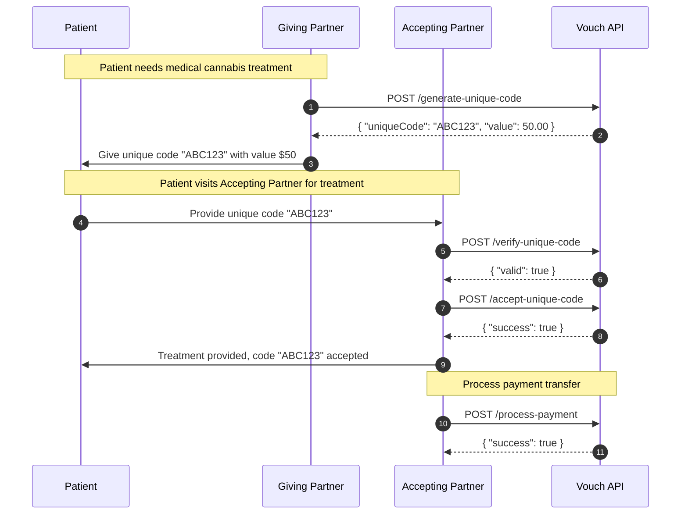
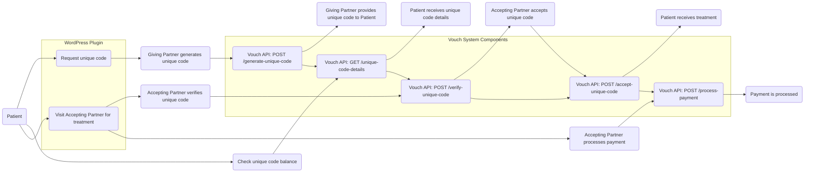

# Vouch

Our vouch system makes it easy for you to access medical cannabis treatments from registered clinics and trusted partners in New Zealand. With a simple and secure process, you can receive the care you need and support the growth of the medical cannabis industry.

[//]: # (badges)

### Support

  

### Test Coverage

    

[//]: # (badges)

## Focus

- The program will provide a unique code to patients that can be redeemed with registered clinics and trusted partners for medical cannabis treatments.
- The unique code will have a fixed value that will be determined when the code is requested.
- The program will provide a web portal for patients to check the balance and details of their unique code.
- The program will provide a plugin for WordPress and other PHP or Node.js e-commerce sites to accept the unique code and make it easy for companies to participate.
- The program will ensure that patient data is secure and compliant with relevant regulations.
- The program will be launched in New Zealand and will only be valid for use within New Zealand.
- The program will be tested and refined to ensure that it is user-friendly and effective for both patients and companies.
- The program will be marketed to patients, clinics, and trusted partners to promote its use and growth.
- The program will retain code information until it has been fully redeemed and indicated as expirible. 
- The program will only provide code data when the specific code is provided. 
- The program will rate limit requests and take bad actors into account.
- The program will only provide information about more than one code, or processing information about a code to redeeming registred clinics and redeeming trusted partners. 
- The program will make use of techniques to detect on a best effort basis patient information within user provided content and prevent this data from being processed.
- The program is not intended to be used to store patient information.
- The program is not intended to be used to process patient information.

## Technical Goal 

The program is designed to provide a unique code to patients that can be redeemed with registered clinics and trusted 
partners for medical cannabis treatments. The system will consist of a user-friendly frontend and a secure backend developed with Node.js.

The program will also provide a plugin for WordPress and other PHP or Node.js based e-commerce sites to accept the unique code and make it easy for companies to participate.

## API Surface

The program requires at a minimum:

- An API endpoint for generating unique codes with a fixed value for patients to use.
- An API endpoint for verifying the validity of unique codes when redeemed by clinics and trusted partners.
- An API endpoint for retrieving the details and balance of a unique code for patients to check.
- An API endpoint for adding and removing registered clinics and trusted partners.
- An API endpoint for adding and removing unique codes associated with specific clinics and trusted partners.
- An API endpoint for retrieving data related to unique codes and their associated clinics and trusted partners.
- An API endpoint for securely communicating with Xero for payment processing.
- An API endpoint for securely communicating with the WordPress plugin and other e-commerce sites to accept the unique codes.
- An API endpoint for logging and monitoring system activity and errors.

### Diagram





## API Documentation 

See the vouch [API Documentation](https://vouch.patient.nz/api/documentation) for more information

## JavaScript / TypeScript Client

The Vouch API is accessible using the [@socialbaking/vouch](https://www.npmjs.com/package/@socialbaking/vouch) npm package

### Usage

```bash
npm i --save @socialbaking/vouch
```

```typescript
import { Client } from "@socialbaking/vouch";

// Access to public information
const publicClient = new Client({
    // url: "https://vouch.patient.nz",
    // version: 1,
    // ...
});

// Access the API as an integrating partner
const privateClient = new Client({
    partnerId: "079260c4-6a34-4fa0-9cd4-a47efaec25f4", // Created with the public client
    accessToken: "651036de....bcafc5dada6" // Provided to integrating partners
});

{
    // In staging mode, an 
    const { partnerId, accessToken } = await publicClient.addPartner({
        partnerName: "The Clinic",
        location: "Auckland, New Zealand"
    });
    
    const client = new Client({
        partnerId,
        accessToken
    });
    
    const uniqueCode = await client.generateUniqueCode(50);
    
    // Accept part of the code or whole code
    if (await client.verifyUniqueCode(uniqueCode, 25)) {
        await client.acceptUniqueCode(uniqueCode, 25);
    }
    
}
```

### Client's TypeScript Interface

[//]: # (typescript client)

```typescript
export interface UniqueCode extends Record<string, unknown> {
    uniqueCode: string;
    value: number;
    partnerId: string;
}
export interface PublicUniqueCode {
    uniqueCode: string;
    value: number;
    partnerId: string;
}
export interface SystemLog extends Record<string, unknown> {
    message: string;
    uniqueCode?: string;
    value?: number;
    partnerId?: string;
    action?: string;
}
export interface PartnerData {
    partnerName: string;
    location: string;
    onsite?: boolean;
    remote?: boolean;
    clinic?: boolean;
    pharmacy?: boolean;
    partnerDescription?: string;
}
export interface Partner extends PartnerData {
    partnerId: string;
    accessToken?: string;
}
export interface ClientOptions {
    partnerId?: string;
    accessToken?: string;
    version?: number;
    prefix?: string;
    url?: string | URL;
}
export interface Client {
    generateUniqueCode(value: number): Promise<string>;
    verifyUniqueCode(uniqueCode: string, value?: number): Promise<boolean>;
    addPartner(partner: PartnerData): Promise<Partner>;
    assignUniqueCode(uniqueCode: string, value: number, partnerId: string): Promise<void>;
    processPayment(uniqueCode: string): Promise<void>;
    acceptUniqueCode(uniqueCode: string, value: number): Promise<void>;
    getUniqueCode(uniqueCode: string): Promise<UniqueCode>;
    getPublicUniqueCode(uniqueCode: string): Promise<PublicUniqueCode>;
    listUniqueCodes(): Promise<UniqueCode[]>;
    listPartners(): Promise<Partner[]>;
    listSystemLogs(): Promise<SystemLog[]>;
}
```

[//]: # (typescript client)